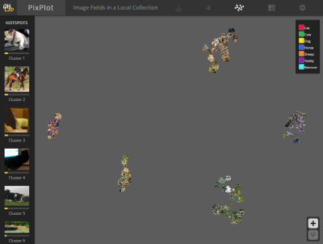
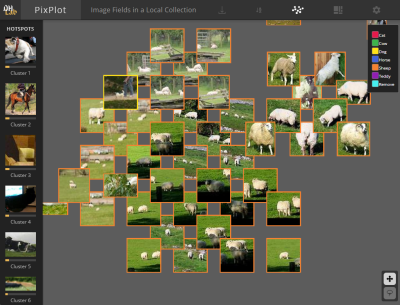
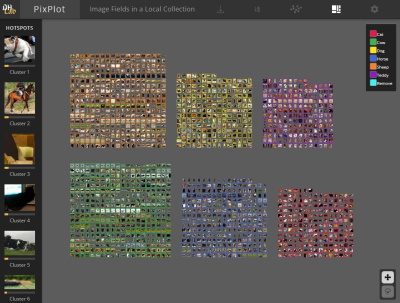

# PixPlot Visualization for Image-based Machine Learning Projects

An interactive and zoomable visualization of your whole dataset. This tool is valuable for object detection and classification projects to perform these tasks:
1. Initial investigation and visualization of a labelled (or unlabelled) dataset.
2. Fixing incorrect classifications and removing invalid or confusing images. (Click on an image and update its label, or flag for removal)
3. Visualizing false positive bounding boxes to identify why they are occuring.

Images that look similar are located next to or near each other, making it easy to see where errors occur (in the UMap visualization).

UMap Visualization            |  Interactive and Zoomable          |   Different Views (by label)                |
:-------------------------:|:-------------------------:|:-------------------:
  |   | 

The repo contains:

1. A Pixplot server based on [PixPlot](https://github.com/YaleDHLab/pix-plot). The original PixPlot uses a network trained on ImageNet but we find fine-tuning on your data produces much more accurate visualizations. So we have added:

2. A preparation step to customise the visualization to your image data. The preparation step uses your images and a metadata.csv file to train a PyTorch classification model and then output an image vectors file for clustering by Pixplot (using UMap). See [Fine-tune Pixplot for your own images](./prep_pixplot_files/README.md) for more details. The code to do this is in the prep_pixplot_files folder.
(We use [Pytorch-Accelerated](https://github.com/Chris-hughes10/pytorch-accelerated) to easily and simply train a classification model) 

The Pixplot server requires the following files located in a folder:

    metadata.csv - a file containing the image name, category (see below for more details).
    images/*.* - a sub folder containing the images to visualize
    image_vectors.npy - image vectors from a classification model backbone. (See below for more details)
    
To create the image_vectors.npy for your images we provide code and instructions, see [Fine-tune Pixplot for your own images](./prep_pixplot_files/README.md) for more details. The code to do this is in the prep_pixplot_files folder.


# Quickstart - visualizing the coco dataset bounding box images

To quickly see Pixplot running on bounding box images extracted from the Coco dataset, you can follow this pre-created example which contains all the required files.

First, clone the repo and extract the zip file containing coco validation dataset bounding boxes

```bash
git clone git clone https://github.com/alexhock/pixplotml.git 
cd pixplotml
unzip ./data/coco_trained.zip -d ./data/
```

To run pixplot, there are two options: using Python with a new environment, or using Docker where the environment is managed for you.

### Python quickstart

1. Create a Python environment and install dependencies:

    ```bash
    conda create --name=pixplot python=3.9
    conda activate pixplot
    cd pixplot_server
    pip install -r requirements.txt
    ```

2. Run the pixplot pre-processing.

    ```bash
    cd ../pixplot_server
    python pixplot.py --images "./data/outputs/images/*.jpg" --metadata "./data/outputs/metadata.csv" --image_vectors "./data/outputs/image_vectors.npy"
    ```

3. Start a web server by running:

    ```bash
    python -m http.server 8600
    ```

    Open a browser to: `http://localhost:8600/output`.


### Docker Quickstart

Instead of manually creating a Python environment and performing the steps in the Python quickstart we can instead just use docker to take care of all that.

1. Build and tag the image:

    ```bash
    cd pixplot_server
    docker build -t pixplot:1.0 .
    ```

2. Run pixplot
    ```bash
    cd data
    docker run -v `pwd`/outputs:/data -p 8800:8800 pixplot:1.0 /data 8800 metadata.csv images/*.jpg
    ```

    Open a browser to: `http://localhost:8800/output`


### Further Useful Docker Commands

To stop the running docker container:

```bash
export CONTAINER_ID=`docker ps -lq`
docker stop $CONTAINER_ID
```

Note that if you want to avoid re-running the preprocessing step then you must commit the docker image after the first run.

```
docker ps -a
docker commit <container_id> pixplot:2.0
```

Then to run use the new docker image name pixplot:2.0


# Metadata

Metadata should be in a comma-separated value file, should contain one row for each input image, and should contain headers specifying the column order. Here is a sample metadata file:

| filename | category  | tags    | description   | permalink   | 
| -------- | --------- | ------- | ------------- | ----------- | 
| bees.jpg | yellow    | a\|b\|c | bees' knees   | https://... | 
| cats.jpg | dangerous | b\|c\|d | cats' pajamas | https://... | 

The following column labels are accepted:

| *Column*         | *Description*                                           |
| ---------------- | ------------------------------------------------------- |
| **filename**     | the filename of the image                               |
| **category**     | a categorical label for the image                       |
| **tags**         | a pipe-delimited list of categorical tags for the image |
| **description**  | a plaintext description of the image's contents         |
| **permalink**    | a link to the image hosted on another domain            |
| **year**         | a year timestamp for the image (should be an integer)   |
| **label**        | a categorical label used for supervised UMAP projection |
| **lat**          | the latitudinal position of the image                   |
| **lng**          | the longitudinal position of the image                  |

